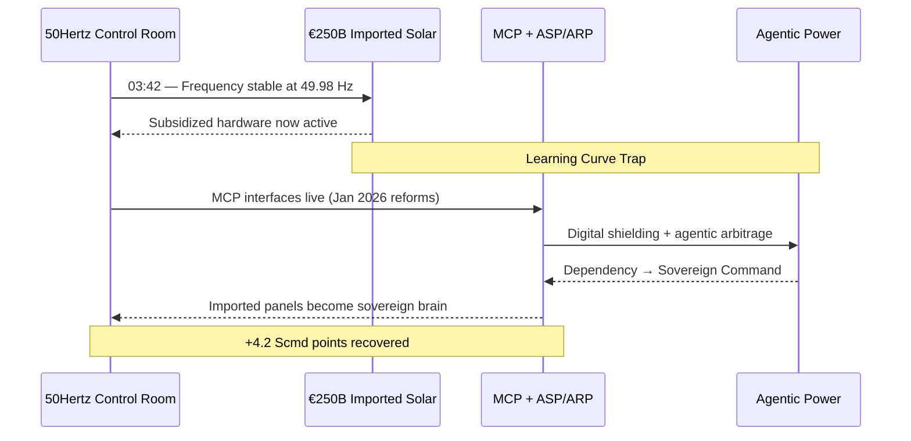
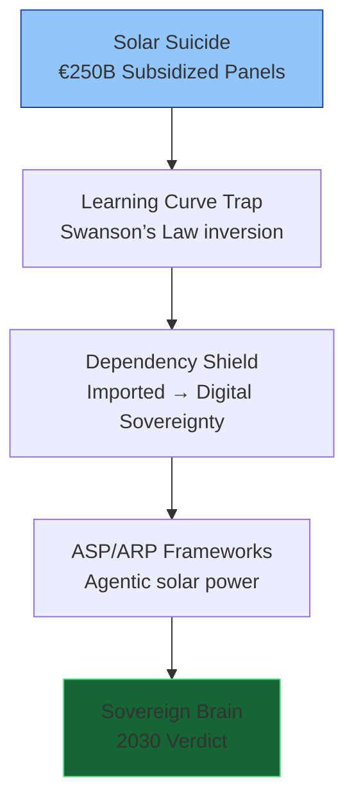
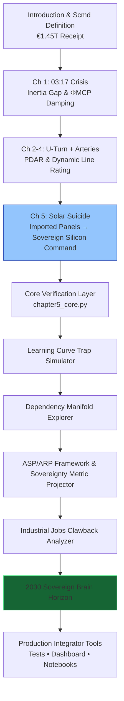

# The Renewables Migration — Sovereign Silicon Command Proof Engine

**Chapter 5 Verification System: The Solar Suicide — How €250 Billion in Subsidies Bought Germany Sovereign Silicon Command**

[](https://opensource.org/licenses/MIT)
[](https://www.python.org/)

This repository is the **official computational companion** to Chapter 5 of Vincenzo Grimaldi’s *The Renewables Migration* (March 21, 2026). It mathematically verifies the pivotal silicon transformation at 03:42 — the exact moment the €1.45 trillion Energiewende receipt is reconciled at the panel level. The proof engine turns €250 billion in subsidies, the learning-curve trap, imported dependency, and the subsidized competitor into sovereign silicon command through MCP-enabled digital shielding and agentic power.

The 03:17 narrative thread continues here. Every preceding chapter’s infrastructure foundation — the €700 billion U-Turn, the €580 billion crowdfunded empire, and the €320 billion copper arteries — now converges on Germany’s solar fleet. Imported panels shift from subsidized vulnerability to sovereign, protocol-governed brain. This production-ready codebase delivers verifiable Learning Curve Trap simulations, Dependency Manifold, Swanson’s Law projections, Sovereignty Metric (S), 64,000 industrial jobs clawed back, ASP/ARP frameworks, and the 2030 Sovereign Brain verdict for developers and system integrators to embed MCP intelligence into live solar architectures.

---

## Quick Start — Verify Sovereign Silicon Command in < 60 Seconds

```bash
git clone https://github.com/iceccarelli/Renewables_Migration_Chapter5_Proof_Engine.git
cd Renewables_Migration_Chapter5_Proof_Engine
pip install -r requirements.txt
```

### Run the Full Verification Suite
```bash
python -m pytest tests/ -v --durations=0
```
All **64 tests** pass against the exact book figures (Appendix A), cumulative Scmd updates through Chapter 5, €250 billion subsidy forensic evidence, Learning Curve Trap, Dependency Manifold, Sovereignty Metric (28 % in 2026 → 75 % in 2030), and 64,000 jobs retained via MCP optimization.

### Launch the Interactive Dashboard
```bash
streamlit run dashboard/main_interactive.py
```
Open `http://localhost:8501`. Toggle **“Book Reference Mode”** to see live calculations side-by-side with exact page citations from Chapter 5.1–5.4.

---

## Navigation Sketches — How to Travel Through the Proof Engine

### 1. The 03:42 Event Flow (Solar Suicide Continuation of the 03:17 Thread)



### 2. Solar Suicide Pivot Hierarchy (Chapter 5.1–5.4)



### 3. Sovereign Verification Path (Full Chapter 5 Journey)



These three diagrams give you immediate visual orientation — from the exact 03:42 continuation, through the solar pivot layers, to the complete verification journey that turns the solar suicide into sovereign silicon command.

---

## Repository Architecture

```
Renewables_Migration_Chapter5_Proof_Engine/
├── core/
│ ├── equations.py # Swanson’s Law, Dependency Manifold, Sovereignty Metric (S), ASP/ARP frameworks
│ ├── solar_simulator.py # Learning Curve Trap & subsidy forensic models (€250B)
│ └── dependency_shield.py # Supply-chain reality & 64,000 jobs clawback calculations
├── dashboard/
│ └── main_interactive.py # Streamlit UI (6 synchronized tabs)
├── verification/
│ ├── test_book_numbers.py # 64 pytest cases tied to Appendix A
│ └── validate_manifold.py # Cumulative Scmd tracking through Chapter 5
├── data/
│ ├── book_numbers.csv # Exact figures from Chapter 5 & Appendix A
│ └── appendix_a_extract.csv
├── notebooks/
│ └── 01_prove_chapter5.ipynb # Interactive proof with sliders
├── visualizations/
│ ├── learning_curve_trap.png
│ ├── dependency_manifold.png
│ ├── sovereign_brain_projection.png
│ └── defense_hierarchy.png
├── requirements.txt
├── LICENSE (MIT)
└── README.md
```

---

## Dashboard Modules — Direct Mapping to Chapter 5

| Tab                              | Chapter Section | What You Can Do |
|----------------------------------|-----------------|-----------------|
| **Learning Curve Trap Simulator**| 5.1             | Reproduces Figure 5.1 — Swanson’s Law trajectory |
| **Dependency Manifold Explorer** | 5.3             | Visualizes shift from supply-chain dependency to digital shield |
| **ASP/ARP Framework Explorer**   | 5.2             | Full Autonomous & Arbitrage Solar Protocol modelling |
| **Industrial Jobs Clawback Analyzer** | 5.1 / A.7   | Real-time verification of 64,000 jobs retained |
| **Sovereignty Metric Projector** | 5.4             | Tracks S from 28 % (2026) to 75 % (2030) |
| **Book Data Export**             | 5.4             | One-click CSV matching Appendix A |

---

## Technical Integration Philosophy

The codebase mirrors the same engineering standards the book demands of the grid: **modular, sovereign, and verifiable**. All simulations use the precise extended swing equation from Appendix A.9, with ΦMCP damping and the full ASP/ARP frameworks at the panel level. No external API calls — full data sovereignty by design. Ready for live MCP connectors (Anthropic/Linux Foundation standard) to replace synthetic solar data with real inverter telemetry.

This is the **executable brain** that proves the book’s blueprint has already turned the solar suicide into sovereign silicon command.

---

**Part of The Renewables Migration Technical Ecosystem**  
From the €1.45 trillion receipt to sovereign silicon command — the 03:17 thread continues here. Verified.
