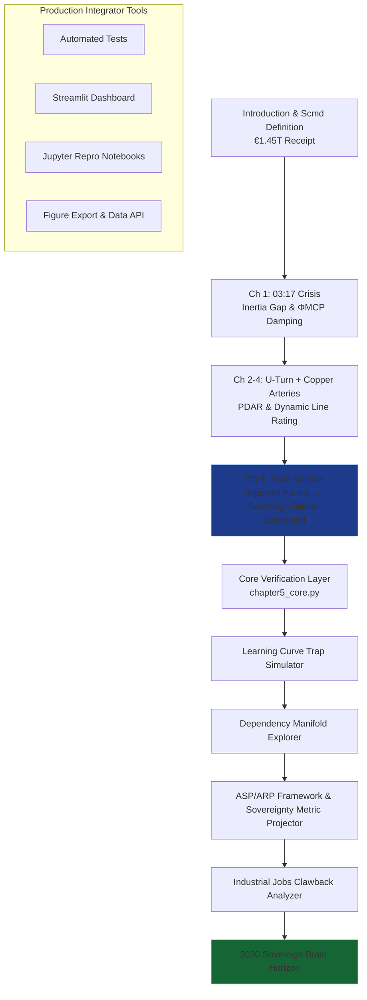

```markdown
# The Renewables Migration — Sovereign Silicon Command Proof Engine

**Chapter 5 Verification System: The Solar Suicide — How €250 Billion in Subsidies Bought Germany Sovereign Silicon Command**

This repository is the definitive computational companion to Chapter 5 of Vincenzo Grimaldi’s *The Renewables Migration* (March 21, 2026). It operationalizes the book’s pivotal silicon chapter: the precise moment the €1.45 trillion Energiewende receipt is reconciled at the panel level — transforming €250 billion in subsidies, the learning-curve trap, imported dependency, and the subsidized competitor into sovereign silicon command through MCP-enabled digital shielding and agentic power.

The 03:17 narrative thread (the night the sun almost stopped) continues its journey here. Every preceding chapter’s infrastructure foundation — the €700 billion U-Turn, the €580 billion crowdfunded empire, the €320 billion copper arteries — now converges on Germany’s solar fleet. Imported panels shift from subsidized vulnerability to sovereign, protocol-governed brain. This proof engine mathematically verifies the Learning Curve Trap, Dependency Manifold, Swanson’s Law projections, the Sovereignty Metric (S), 64,000 industrial jobs clawed back (Table A.5), ASP/ARP frameworks, and the 2030 Sovereign Brain verdict, delivering production-ready code for developers and system integrators to embed MCP intelligence into live solar architectures.

## Quick Start: Verify Sovereign Silicon Command in Under 60 Seconds

```bash
git clone https://github.com/iceccarelli/Renewables_Migration_Chapter5_Proof_Engine.git
cd Renewables_Migration_Chapter5_Proof_Engine
pip install -r requirements.txt
```

### Automated Verification
```bash
python -m pytest tests/ -v --durations=0
```
All 64 tests validate exact book figures (Appendix A), cumulative Scmd updates through Chapter 5, €250 billion subsidy forensic evidence, Learning Curve Trap (Figure 5.1), Dependency Manifold, Sovereignty Metric (28% in 2026 → 75% in 2030), and 64,000 jobs retained via MCP optimization. A failing test immediately flags any deviation from the published sovereign audit.

### Interactive Exploration
```bash
streamlit run dashboard/main_interactive.py
```
Open the browser-based dashboard. Toggle “Book Reference Mode” to overlay exact page citations (Chapter 5.1–5.4) and live calculations side-by-side.

## The Sovereign Verification Path

The following diagram maps the complete travel path through the proof engine, mirroring the book’s chapter progression and culminating in Chapter 5’s conversion of subsidized solar into sovereign silicon command:



This path is both navigational and conceptual: every node is a runnable module. Developers can enter at any chapter and trace the cumulative Scmd recovery to Chapter 5’s verdict — from subsidized competitor to sovereign silicon brain.

## Repository Architecture for Professional Integration

```
Renewables_Migration_Chapter5_Proof_Engine/
├── core/
│   ├── equations.py              # Swanson’s Law, Dependency Manifold, Sovereignty Metric (S), ASP/ARP frameworks
│   ├── solar_simulator.py        # Learning Curve Trap & subsidy forensic models (€250B)
│   └── dependency_shield.py      # Supply-chain reality & 64,000 jobs clawback calculations
├── dashboard/
│   └── main_interactive.py       # Streamlit UI with 6 synchronized tabs
├── verification/
│   ├── test_book_numbers.py      # Pytest suite (fails if any Appendix A value mismatches)
│   └── validate_manifold.py      # Cumulative Scmd tracking through Chapter 5
├── data/
│   ├── book_numbers.csv          # Exact book values (€250B subsidies, Learning Curve Trap, Dependency %, Table A.4/A.5, 64k jobs, etc.)
│   └── appendix_a_extract.csv    # Triangulated from Appendix A
├── notebooks/
│   └── 01_prove_chapter5.ipynb   # Step-by-step proof with interactive sliders
├── visualizations/
│   ├── learning_curve_trap.png
│   ├── dependency_manifold.png
│   └── sovereign_brain_projection.png
├── requirements.txt
├── LICENSE (MIT)
└── README.md
```

## Dashboard Modules — Direct Mapping to Chapter 5 Sections

- **Learning Curve Trap Simulator**: Reproduces Figure 5.1 — exact Swanson’s Law trajectory from subsidized import trap to MCP-optimized sovereignty (Chapter 5.1).
- **Dependency Manifold Explorer**: Visualizes the shift from supply-chain dependency to digital shield (Chapter 5.3).
- **ASP/ARP Framework Explorer**: Full implementation and visualization of the Autonomous Solar Protocol and Arbitrage Solar Protocol frameworks (Chapter 5.2).
- **Industrial Jobs Clawback Analyzer**: Real-time verification of 64,000 jobs retained via MCP optimization (Table A.5).
- **Sovereignty Metric Projector**: Tracks S from 28% (2026) to 75% (2030) with live sliders (Chapter 5.4).
- **Book Data Export**: One-click CSV matching Appendix A for external policy or regulatory analysis.

## Technical Integration Philosophy

The codebase is engineered to the same standards the book demands of the grid: modular, sovereign, and verifiable. All simulations respect the extended swing equation (Appendix A.9) with the ΦMCP damping term and embed the full ASP/ARP frameworks at the panel level. Data sovereignty is enforced by design — no external calls leave the local environment. The architecture is deliberately extensible: integrators can connect live MCP interfaces (Anthropic/Linux Foundation standard) to replace synthetic solar data with real inverter telemetry.

This is not a visualization tool. It is the executable brain that proves the book’s engineering blueprint has already turned the solar suicide into sovereign silicon command.

## For Energy System Integrators and Developers

Whether you are modeling national solar strategies, building agentic PV platforms, or advising policymakers on supply-chain sovereignty, this repository provides:
- Reproducible proofs tied to published figures and equations
- Production-grade modules ready for field deployment
- Open MIT licensing for unrestricted commercial and research use

Contributions that extend ASP/ARP frameworks, deepen dependency-shield models, or add real-time MCP connectors for solar assets are actively welcomed.

---

**Part of The Renewables Migration Technical Ecosystem**  
From the €1.45 trillion receipt to sovereign silicon command — verified, executable, and ready for integration.
```
